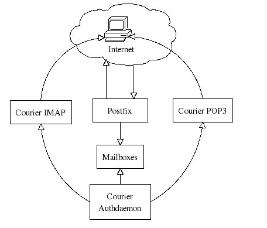
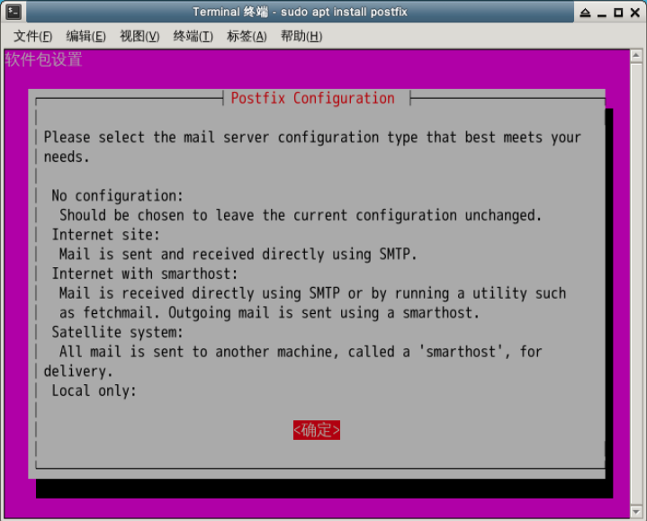

# 安装配置　 Postfix
---
+ 安装配置过程中，postfix 通过 Internet 发送和接收 email，并存储在用户邮箱里。同时客户也可以通过 IMAP 或者 POP3 恢复他们的邮件。其中的客户认证是通过　 Courier Authdaemon 模块的。下图表示出了这个过程：
+ 
---
# 安装软件
---
+ $ sudo apt-get update
+ $ sudo apt-get install -y postfix

+ 出现安装界面时，首先按下 <tab> 键切换到确定，然后按下回车。
+ 
+ 接下来需要给我们的服务器设置一个域名，不妨就设置为　cyrus_mail.com，然后按下 <tab> 切换到确定，按下回车。
---
# 配置postfix
---
+ 使用 vim 编辑配置文件：
+ $ sudo vim /etc/postfix/main.cf
+ 在第 31 行，编辑 myhostname，修改为 myhostname = cyrus_mail.com
+ 把　alias_map　参数修改为 alias_maps = hash:/etc/postfix/virtual
+ 设置　mynetworks　段落，它定义可以使用这台服务器的主机，我们这里就用默认的本地地址。你也可设置为其他地址
+ 添加本地用户
+ $ sudo useradd –d /usr/master -m master
+ # 设置密码为 123456
+ $ sudo passwd master
+ 编辑邮件地址
+ 编写之前设置的　 virtual 　文件，这些邮箱地址是用来传送邮件的
+ $ sudo vim /etc/postfix/virtual
+ 在这个文件里，我们将设置一个表，对应相关的邮件地址。
+ master@shiyanlou.com      master
+ shiyanlou@shiyanlou.com   shiyanlou
+ root@shiyanlou.com        root
+ 通过调用下面这个命令来实现我们的映射：
+ $ sudo postmap /etc/postfix/virtual
+ 重启 postfix，完成我们的修改：
+ $ sudo service postfix restart
---

# 测试我们的安装配置
---
+ 安装一个命令行收发邮件的软件
+ $ sudo apt-get install mailutils
+ 写一封邮件
+ $ vim hello.txt
+ 发送邮件
+ $ mail -s "test" master@shiyanlou.com < hello.txt
+ 其中 -s 参数是指邮件的标题，< 后面是将要发送的邮件内容从 hello.txt 中重定向。
+ 切换到 master 用户，查看我们的邮件
+ # 密码输入 123456
+ $ su master
+ # 查看邮件
+ $ mail