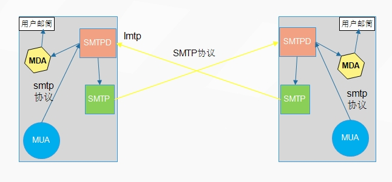
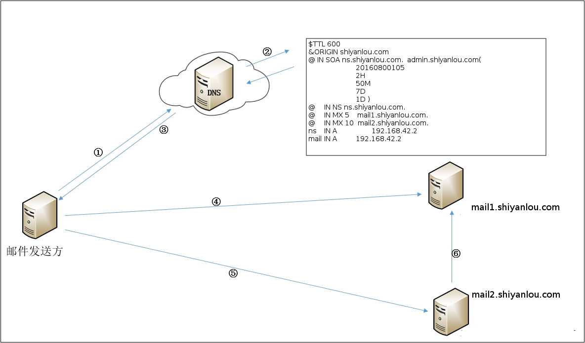

# 邮件服务器基本的工作原理
---
+ MUA(Mail User Agent)：向外发送邮件，以及提供用户浏览与编写邮件的功能。
+ MTA(Mail Transfer Agent)：（可以理解为 smtpd 服务器）帮忙将用户的邮件传递出去或接收进来。
+ MDA(Mail Delivery Agent)：将接收下来的邮件存放到对应用户邮筒当中的程序。通过分析 MTA 所收到邮件的表头或内容，来判断此邮件是属于哪个用户，然后决定将此邮件投递给哪个用户的邮筒里。
+ MRA(Mail Retrieval Agent)：通过 MRA 服务器提供的邮政服务协议（POP）来接收自己的邮件。
---
+ 
+ 用户（MUA）通过 SMTP 协议将邮件发送到服务器（MTA），服务器分解发现如果是本地的邮件传输则通过 lmtp 来传送，如果是远程邮件将调用本地的客户端使用 SMTP 协议向对方服务器传送。
+ 当对方的服务器接收到邮件之后，发现如果不是本机所负责的域，则将邮件交给本机的邮件客户端，根据邮件目标域请求 DNS 解析，将邮件发送到目标服务器，或者丢至下一跳此过程称为邮件中继，如果发现是本机负责区域内的用户，则 SMTPD 将邮件转交给 MDA，由 MDA 把邮件传递到用户的邮筒。

# 邮件服务器与 DNS 之间的关系
---
+ 
+ 当发件方需要发送邮件给对方邮件服务器，需要向 DNS 请求查询对方邮件服务器的 MX 记录。
+ DNS 通过查询 MX 表信息。
+ 将查询到的 MX 信息返回给发送方。
+ 发送方根据优先级，将邮件投递给对方优先级高的邮件服务器（mail1）。
+ 如果主邮件服务器过于繁忙，或者不在线的时候，会将邮件投递给辅的邮件交换器（mail2）上。
+ 待主邮件服交换器空闲下来后，mail2 会将代替接收下来的邮件再转给主邮件交换器（mail1）。
+ 注：当 DNS 上存在多个 MX 记录的主机这时就是根据 DNS 的邮件级判断了。DNS 上定义的值越小，其优先级越高。辅助交换器接受到邮件并不能保存邮件。而是这个辅助交换器会等到主邮件交换器空闲的时候把代替它接受下来的邮件在转给主邮件交换器。所以任何邮件处理都是主邮件交换器处理的。所以我们实际情况下，如果有 2 台服务器做邮件交换器，性能比较高的应该为主的。